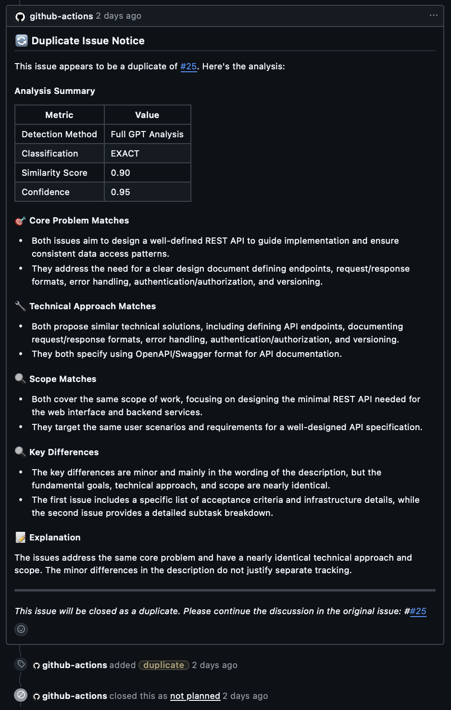
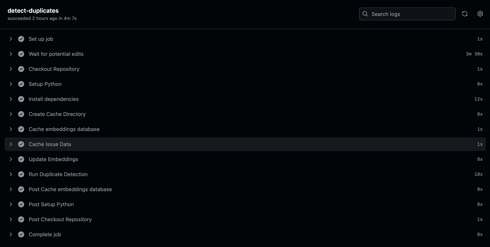
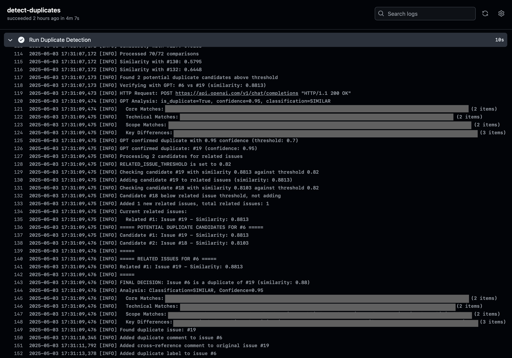

# AI-Powered GitHub Issue Duplicates & Relations Detector

This GitHub Action automatically detects duplicate and related issues in your repository using embeddings and OpenAI's API. It helps maintain a clean issue tracker by identifying potential duplicates when new issues are created and cross-referencing related issues.

## 📋 Features

- **Automatic Duplicate Detection**: Identifies potential duplicate issues based on semantic similarity
- **Related Issues Cross-Reference**: Identifies issues that are related but not duplicates and adds cross-reference comments
- **Customizable Thresholds**: Configure similarity thresholds for duplicate and related issue detection
- **Automated Issue Management**: Adds "duplicate" labels to identified duplicate issues, closes them, and marks them as "not planned"
- **Sub-Issue Migration**: Automatically moves sub-issues from closed duplicate issues to the kept issue
- **Issue Type Prioritization**: Intelligently decides which issue to keep open based on issue type priority
- **Comprehensive Logging**: Detailed logging for troubleshooting and monitoring
- **Open Issues Only**: Only processes open issues to avoid duplicating closed issues



## 🚀 Setup

### Prerequisites

- GitHub repository with issues enabled
- OpenAI API key
- Issue types in your repository (epic, task, sub-task) for prioritization when handling duplicates

### Installation

#### Marketplace Installation
The easiest way to install is directly from the GitHub Marketplace:

1. Go to the [AI Duplicate Issue Detector](https://github.com/marketplace/actions/ai-duplicate-issue-detector) on GitHub Marketplace
2. Click "Use latest version"
3. Follow the setup instructions to add the workflow to your repository

#### Manual Installation

1. Create a `.github/workflows/duplicate-detection.yml` file in your repository
2. Copy the example workflow from [examples/duplicate-detection.yml](examples/duplicate-detection.yml)
3. Configure your OpenAI API key as a repository secret
4. The action will automatically run when new issues are created, reopened or edited

## ⚙️ Configuration

### Required Secrets

Add these secrets to your repository:

| Secret Name | Description |
|-------------|-------------|
| `OPENAI_API_KEY` | Your OpenAI API key |
| `GITHUB_TOKEN` | GitHub token with issues:write and pull-requests:write permissions (automatically provided) |

### Action Inputs

Configure these in your workflow file:

| Input Name | Description | Default |
|------------|-------------|---------|
| `openai-api-key` | OpenAI API key for embeddings and analysis | (Required) |
| `duplicate-threshold` | Similarity threshold for duplicate detection (0-1) | 0.85 |
| `related-issue-threshold` | Similarity threshold for related issues (0-1) | 0.82 |
| `embedding-model` | OpenAI embedding model to use | text-embedding-3-large |
| `max-issues-to-process` | Maximum number of issues to process in a single run | 100 |
| `issue-number` | Specific issue number to check (if not triggered by issue event) | (Optional) |

### Environment Variables (For Comprehensive Implementation)

If you're using the comprehensive example rather than the simple action, use these environment variables:

| Environment Variable | Description | Default |
|---------------------|-------------|---------|
| `OPENAI_API_KEY` | OpenAI API key | (Required) |
| `DUPLICATE_THRESHOLD` | Similarity threshold for duplicate detection | 0.85 |
| `RELATED_ISSUE_THRESHOLD` | Similarity threshold for related issues | 0.82 |
| `EMBEDDING_MODEL` | OpenAI embedding model to use | text-embedding-3-large |
| `MAX_ISSUES_TO_PROCESS` | Maximum number of issues to process | 100 |
| `ISSUE_NUMBER` | Specific issue number to check | (From event or input) |

### Example Workflows

Two example workflows are provided:

1. **Simple Implementation** - Using the published action:

```yaml
name: Detect Duplicate Issues

on:
  issues:
    types: [opened, edited, reopened]
  workflow_dispatch:
    inputs:
      issue_number:
        description: 'Issue number to check for duplicates'
        required: true
        type: number

jobs:
  detect-duplicates:
    runs-on: ubuntu-latest
    steps:
      - name: Wait for potential edits
        if: github.event.issue
        run: |
          echo "Waiting 3.5 minutes for potential additional edits..."
          sleep 210

      - name: Detect Duplicate Issues
        uses: username/ai-duplicate-detector@v1
        with:
          openai-api-key: ${{ secrets.OPENAI_API_KEY }}
          duplicate-threshold: 0.85
          related-issue-threshold: 0.82
          embedding-model: 'text-embedding-3-large'
          max-issues-to-process: 100
          issue-number: ${{ github.event.issue.number || inputs.issue_number }}
```

2. **Comprehensive Implementation** - For more control:

See [examples/comprehensive-implementation.yml](examples/comprehensive-implementation.yml) for a full implementation that runs the Python scripts directly.

## 📂 Repository Structure

```
.
├── action.yml                        # Action metadata file
├── Dockerfile                        # Container definition for the action
├── requirements.txt                  # Python dependencies
├── src/                              # Core Python scripts
│   ├── detect_duplicates.py          # Core logic for duplicate detection
│   ├── duplicate_detector.py         # Duplicate detection implementation
│   ├── embedding_store.py            # Storage for issue embeddings
│   ├── fetch_bulk_issues.py          # Fetches issues from GitHub API
│   ├── issue_embedder.py             # Handles embedding generation
│   ├── openai_rate_limiter.py        # Manages API rate limits
│   └── update_embeddings.py          # Maintains embeddings database
├── examples/                         # Example usage
│   ├── duplicate-detection.yml       # Simple example using the action
│   └── comprehensive-implementation.yml # Full example with all steps
├── .github/workflows/                # GitHub workflows
│   └── release.yml                   # Workflow for releasing to marketplace
├── CODE_OF_CONDUCT.md                # Code of conduct
├── CONTRIBUTING.md                   # How to contribute
├── LICENSE                           # MIT License
└── README.md                         # This file
```

## 🔄 Workflows

### ai-duplicate-detector.yaml

This workflow runs when:
- A new issue is created (opened)
- An issue is reopened
- An issue is edited
- On manual trigger (workflow_dispatch)

The workflow includes a built-in 3.5-minute delay to allow for additional edits before processing:

```yaml
# From ai-duplicate-detector.yaml
steps:
  - name: Wait for potential edits
    if: github.event.issue
    run: |
      echo "Waiting 3.5 minutes for potential additional edits..."
      sleep 210
```



The workflow also has concurrency control to prevent multiple runs for the same issue:

```yaml
# From ai-duplicate-detector.yaml
concurrency:
  # Use issue number if available, otherwise use a unique identifier
  group: ${{ github.event.issue.number || github.run_id }}
  # Cancel in-progress runs
  cancel-in-progress: true
```

## 💾 Database

The action maintains an SQLite database (`embeddings.db`) that stores:
- Issue IDs, titles and content
- Computed embeddings for each issue
- Processing history

The database is automatically updated when the action runs.

## 🧠 How It Works

1. When a new issue is created, reopened, or edited:
   - The action waits 3.5 minutes to allow for additional edits by the author
   - The action fetches the issue content (only processes open issues)
   - Generates an embedding using OpenAI's API
   - Compares the embedding to existing open issues
   - Identifies potential duplicates and related issues based on similarity scores

2. For duplicate issues (similarity > duplicate-threshold):
   - Determines which issue to keep open based on issue type priority
   - Adds a comment linking to the chosen "main" issue
   - Applies the "duplicate" label to the other issue

3. For related issues (similarity between related-issue-threshold and duplicate-threshold):
   - Adds cross-reference comments to both issues



### Issue Type Prioritization

When duplicate issues are detected, the system intelligently decides which issue to keep open based on the issue type. The priority order is:

1. Epic (highest priority - value 3)
2. Task (medium priority - value 2)
3. Sub-task (lowest priority - value 1)

The function first checks the issue type field, and if not available, falls back to checking for keywords in the title.

For example:
- If an "epic" issue and a "task" issue are duplicates, the "epic" issue will be kept open
- If two "task" issues are duplicates, the older one will be kept open

This ensures that more significant issues (like epics) take precedence over less significant ones when duplicates are found.

## 🔧 Advanced Configuration

### Using Docker Directly

This action can also be run as a Docker container. The Dockerfile is provided in the repository.

```bash
docker build -t ai-duplicate-detector .
docker run -e OPENAI_API_KEY="your-key" -e GITHUB_TOKEN="your-token" ai-duplicate-detector
```

### Customizing Similarity Thresholds

Adjust the thresholds to fine-tune detection sensitivity:
- Higher threshold = fewer false positives but might miss some duplicates
- Lower threshold = catches more potential duplicates but may include more false positives

### Processing Delay

The processing delay is set to 3.5 minutes (210 seconds) to allow for additional edits before processing. To change this delay, modify the `sleep 210` value in your workflow file.

## 🔍 Troubleshooting

### Common Issues

1. **Action not running**: Ensure the workflow file is properly configured and GitHub Actions is enabled for your repository.

2. **No duplicates detected**: Check the threshold values - they might be set too high.

3. **Too many false positives**: Increase the threshold values.

4. **API Rate Limiting**: If you hit GitHub API or OpenAI API rate limits, the action implements exponential backoff and retry mechanisms.

5. **Issue prioritization not working**: Verify your repository has issue types properly configured (epic, task, sub-task).

6. **Authentication errors**: Ensure your OPENAI_API_KEY and GITHUB_TOKEN are properly set.

### Viewing Logs

The action includes comprehensive logging. To view logs:
1. Go to the Actions tab in your GitHub repository
2. Click on the relevant workflow run
3. Expand the steps to see detailed logs

## 📊 Example Output

When a duplicate is detected:
```
Potential duplicate of #42 found: Similarity score 0.89
Issue #42 type: epic, Issue #123 type: task
Keeping issue #42 open (higher priority type)
Adding comment to issue #123 referencing the original issue #42
Adding "duplicate" label to issue #123
```

When related issues are found:
```
Related issue #56 found: Similarity score 0.83
Adding cross-reference comments to issues #123 and #56
```

## 📝 License

MIT

## 🤝 Contributing

Contributions are welcome! Please feel free to submit a Pull Request. 